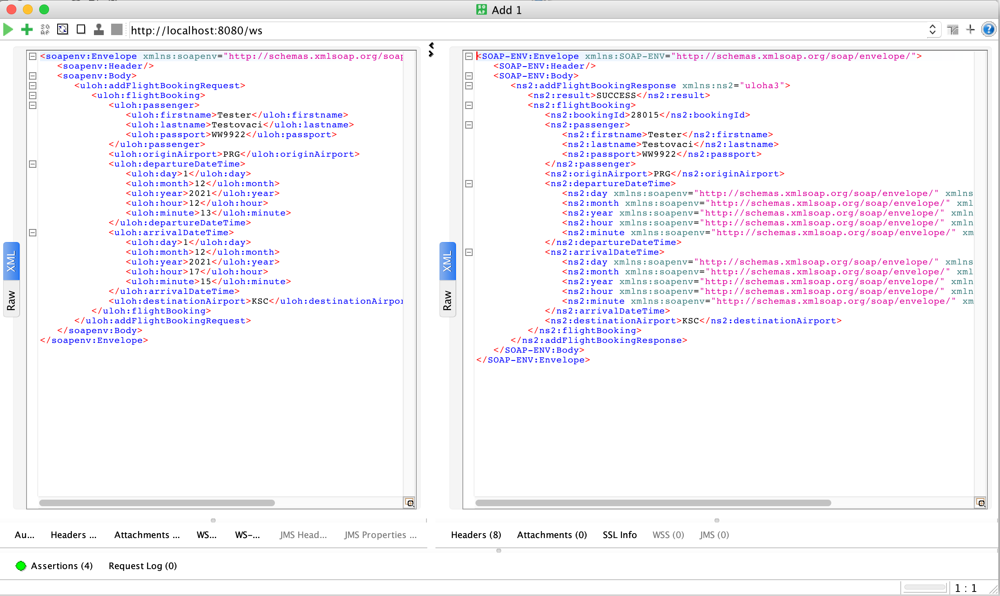
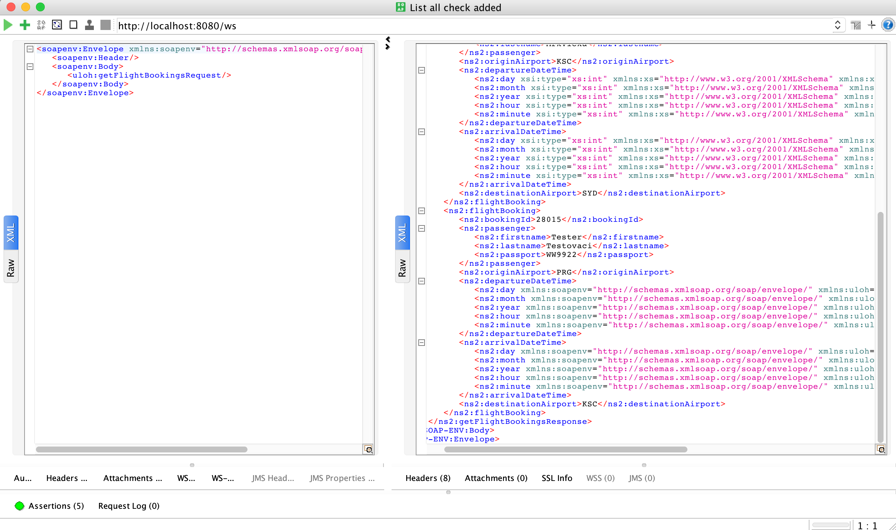
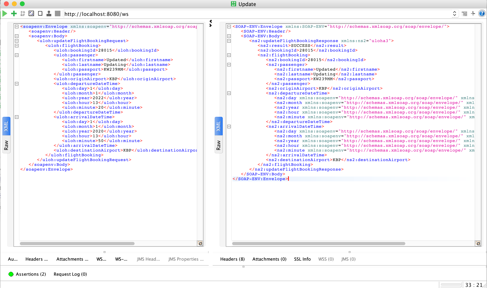
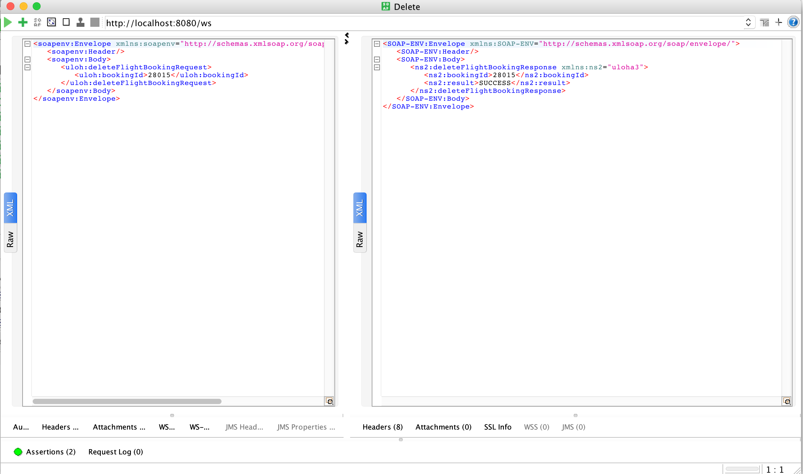
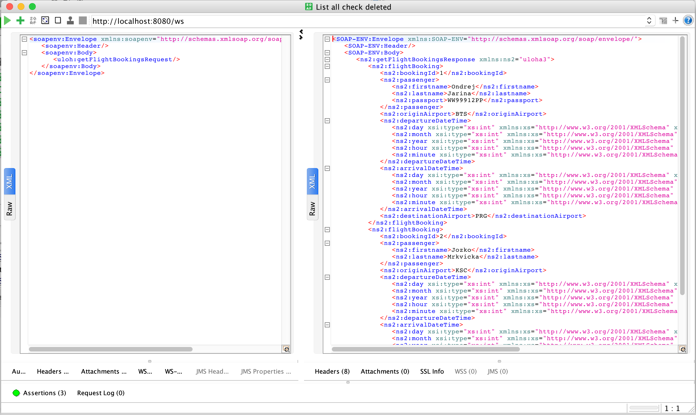
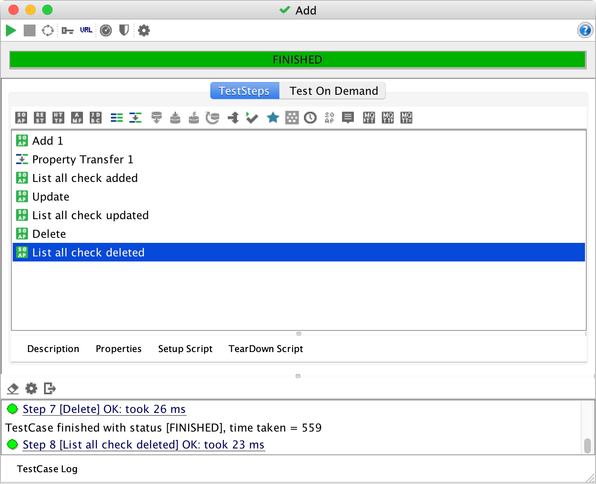

# Úloha 3
## Web Services

Úlohou bolo vytvoriť aplikáciu na rezerváciu leteniek, ktorá bude obsahovať operácie na vypísanie všetkývch existujúcich rezervácií, pridanie novej rezervácie, aktualizovanie existujúcej rezervácie a odstránenie rezervácie.

Tieto operácie a príslušné objekty boli najprv navrhnuté pomocou XML štruktúry v súbore [flights.xsd](src/main/resources/flights.xsd).
Pomocou jaxb2 boli tieto operácie a objekty vygenerované ako Java kód.
---
### Objekty

- Passenger
  - reprezentuje zákazníka, má atribúty *firstname* (krstné meno), *lastname* (priezvisko), *passport* (číslo pasu)
- FlightBooking
  - rezervácia letu, atribúty sú _bookingId_, _Passenger_, _originAirport_ (letisko odletu), _destinationAirport_ (letisko príletu), _departureDateTime_, _arrivalDateTime_ (čas odletu a príletu)
- DateAndTime
  - reprezentuje čas a dátum
- AirportIdentifier
  - enum, obsahuje kódy letísk, z ktorých sú umožnené odlety
- Result
  - enum, obsahuje možné výsledky (FAIL, SUCCESS)
- WebServiceConfig
  - konfigurácia web služby
- WebServiceRepository
  - úložisko pre všetky rezervácie letov (implementované ako ArrayList), na začiatku sa pri inicializácii do neho vložia 2 objekty
- WebServiceEndpoint
  - obsahuje operácie, ktoré je možné obsluhovať cez SOAP requesty

### Operácie

- /ws/getFlightBookingsRequest
  - operácia GET 
  - získanie všetkých zarezervovaných letov
```
getFlightBookings(@RequestPayload GetFlightBookingsRequest request)
```

- /ws/addFlightBookingRequest
  - operácia POST
  - vráti 5-miestne bookingID
  - pridanie rezervácie letu, cez SOAP sa pošlú atribúty objektu FlightBookig
```
postFlightBooking(@RequestPayload AddFlightBookingRequest request)
```

- /ws/deleteFlightBookingRequest
  - operácia DELETE
  - odstránenie rezervácie, na základe bookingID
```
deleteFlightBooking(@RequestPayload DeleteFlightBookingRequest request)
```

- /ws/updateFlightBookingRequest
  - operáciaPUT
  - aktualizovanie rezervácie, na základe bookingId
```
updateFlightBooking(@RequestPayload UpdateFlightBookingRequest request)
```
---
### Testovanie funkčnosti

Na testovanie boli vytvorené Test Cases v programe SOAP UI. Pomocou nástroja assertions sa kontrolovalo, či sú operácie vykonané správne.

Testy sa nachádzajú v [tomto súbore](Uloha3-soapui-project.xml).

#### Pridanie rezervácie


### Zoznam rezervácií po pridaní


#### Aktualizácia rezervácie


#### Zoznam rezervácií po aktualizovaní


#### Odstránenie rezervácie


#### Zoznam rezervácií po odstránení


### Stav všetkých testov



