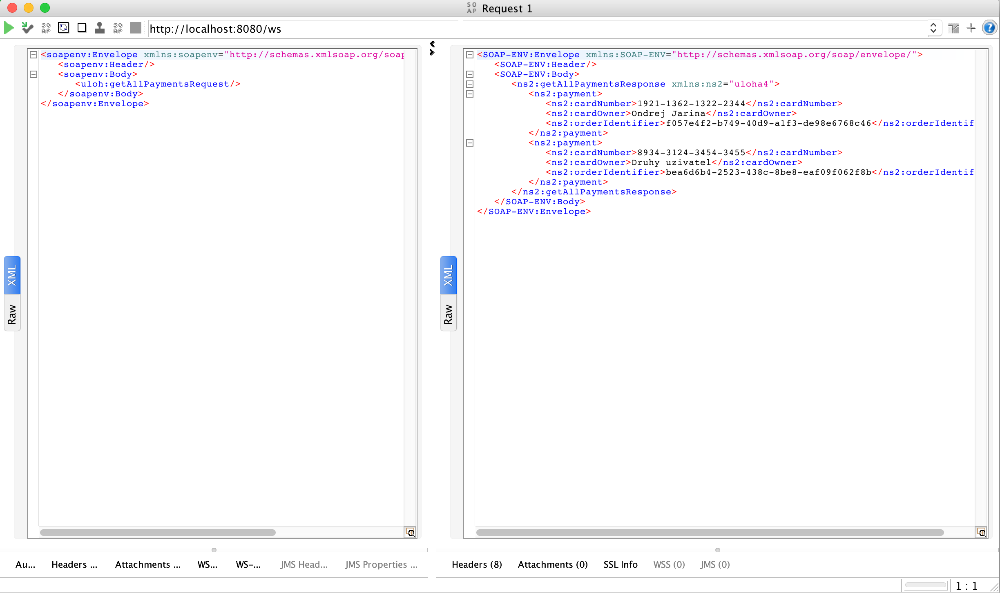

# Úloha 4
## Web Service Composition

Úlohou bolo vytvoriť aplikáciu na spracovávanie platieb. Overenie platobnej karty prebiehalo na vzdialenom serveri.
V pom.xml bolo špecifikované, kde sa nachádza SOAP server, na ktorom bude prebiehať overenie.

### Java objekty

- WebServiceConfig
  - konfigurácia web služby, konfigurácia vzdialeného servera, na ktorý sa má projekt pripojiť
- WebServiceRepository
  - úložisko, implementované ako ArrayList
- WebServiceClient
  - klient na overovanie platnosti karty - má jedinú metódu validateCard, ktorá na serveri skontroluje platnosť karty
- WebServiceEndpoint
  - vystavuje operácie cez API, je možné aplikáciu ovládať
  - metódy: 
    - getAllPayments - získanie všetkých uskutočnených platieb
    - postNewPayment - vykonanie novej platby, kontroluje, či platobná karta s daným číslom a menom je platná
    - ak je platná, uloží ju, ak nie je, neuloží
- Payment
  - objekt reprezentujúci platbu

---

### Testovanie funkčnosti
 
Testovanie prebiehalo v nástroji SOAP UI.

#### Vloženie neplatnej karty

#### Kontrola, že sa neplatná karta neuložila

#### Vloženie platnej karty

#### Kontrola uloženia platnej karty
