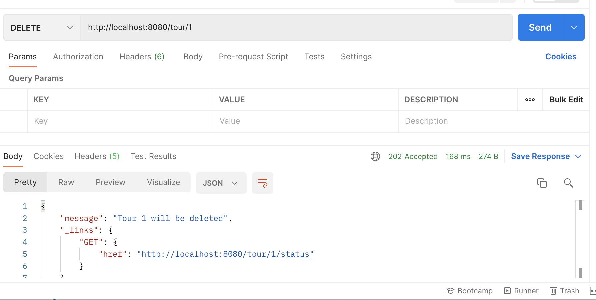
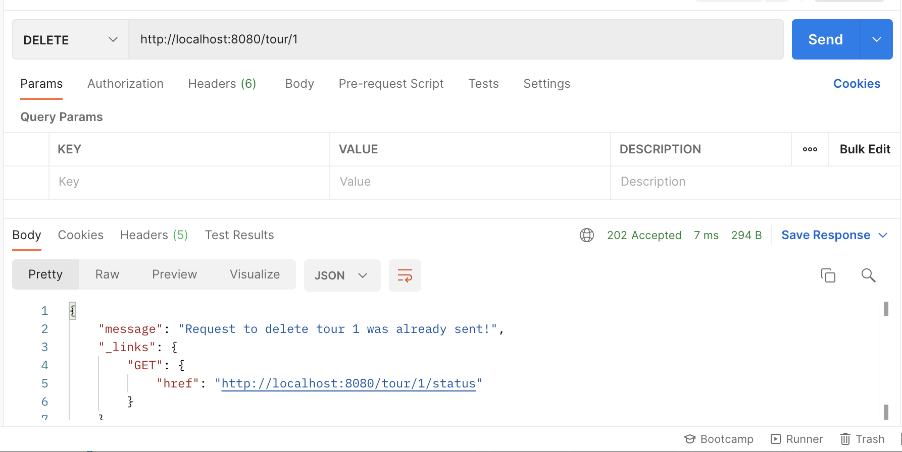
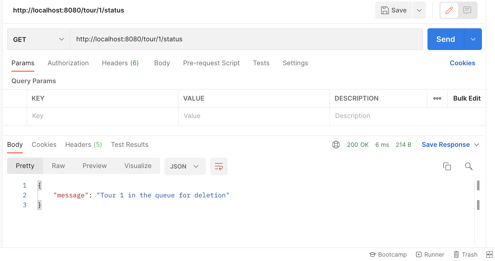
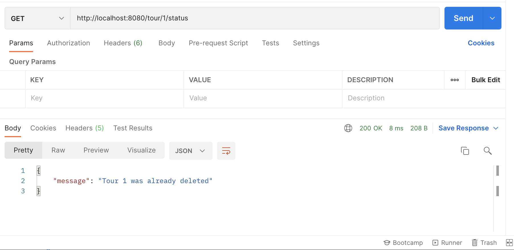
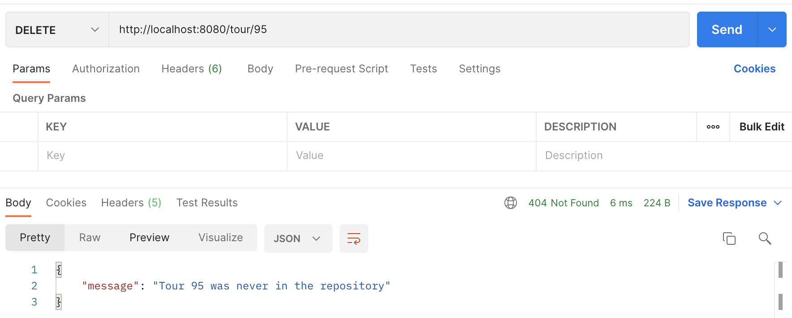

# Úloha 6
## RESTful - Asynchronous operation

Úlohou bolo vytvorť webovú službu, ktorá obsahuje jednu operáciu - DELETE z databázy.
Operácia mala byť implementovaná asynchrónne - užívateľ dostane iba odpoveď, že požiadavka sa spracováva. Samotné odstránenie z databázy môže nastať neskôr.

### JAVA Objekty

#### MessageDTO
Objekt, ktorý obsahuje správu o stave operácie: _Požiadavka na odstránenie je zaznamenaná, požiadavka sa spracováva alebo objekt je už vymazaný_.

#### Tour
Objekt v databáze, ktorý je potrebné vymazať. Parametre sú id, country a tourGuideName.

#### WebServiceRepository
Databáza je implementovaná ako mapa. Kľúče sú ID objektov Tour a hodnoty sú Tour. Obsahuje metódu deleteTour, ktorá na základe ID odstráni objekt z databázy.
Odstránenie prebieha oneskorene (po 15 sekundách). Objekty, ktoré sú naplánované na vymazanie, sa nachádzajú v mape _forDeletionTours_. ID vymazaných objektov sú v zozname deletedTours.
Aby táto metóda mohla byť spustená asynchrónne, používa anotáciu `@Async`. Asynchrónne operácie sú povolené použitím anotácie `@EnableAssync` nad triedou, ktorá obsahuje main metódu.

#### WebServiceController
Rest controller, ktorý vystavuje API. Požiadavka DELETE na URI `.../tours/{tourId}` vyvolá príkaz na odstránenie objektu. Požiadavka vráti správu link, na ktorom je možné sledovať stav vymazania z databázy.
Požiadavka GET na URI `.../tours/{tourId}/status` kontroluje stav vymazania.

### Testiovanie funkčnosti

Na testovanie funkčnosti som použil softvérový nástroj Postman. V nasledujúcej časti sa nachádzajú snímky obrazovky, ktoré dokumentujú poradie odosielania HTTP požiadaviek.

#### DELETE request na odstránenie

#### Opakovaný DELETE request

#### Kontrola stavu pred uplynutím 15 sekúnd

#### Kontrola stavu po uplynutí 15 sekúnd

#### DELETE s ID, ktoré sa v databáze nenachádza

